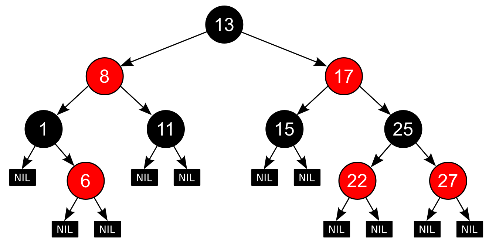

# Red-Black Tree

<p align="center">
  
</p>


This project implements a `Red-Black Tree` data structure in TypeScript. A `Red-Black Tree` is a self-balancing binary search tree that ensures efficient insertion, deletion, and retrieval operations.

## About the Red-Black Tree

The `Red-Black Tree` is a self-balancing binary search tree with the following rules:

1. Every node is either red or black.
2. The root node is always black.
3. All leaves (NIL nodes) are considered black.
4. If a node is red, both its children are black.
5. Every path from a node to its descendant leaves contains the same number of black nodes. This is known as the "black height" property.
6. The key value of a node is greater than all keys in its left subtree and smaller than all keys in its right subtree.

These rules ensure that the `Red-Black Tree` remains balanced, providing efficient search, insert, and delete operations with a guaranteed worst-case time complexity of O(log n), where n is the number of nodes in the tree.

By maintaining these rules, the `Red-Black Tree` ensures that the longest path from the root to a leaf is no more than twice as long as the shortest path, which helps maintain the balanced structure of the tree.

## How the color of the Node is determined
When inserting a new node into a `Red-Black Tree`, the color of the node is determined based on the following rules:

1. By default, the newly inserted node is colored red.
2. If the newly inserted node is the root node, it is colored black to satisfy the root property.
3. If the parent of the newly inserted node is black, the tree remains valid, and no further modifications are needed.
4. If the parent of the newly inserted node is red, additional adjustments must be made to preserve the `Red-Black Tree` properties.

To maintain the `Red-Black Tree` properties, we need to consider the color of the parent, uncle, and grandparent nodes. Based on these colors, several cases may arise:

- `Case 1`: If the parent and uncle nodes are both red, we recolor the parent, uncle, and grandparent. The color of the grandparent is changed to red, while the color of the parent and uncle is changed to black. This ensures that the black height property is preserved, and we continue fixing violations up the tree if needed.

- `Case 2`: If the parent is red and the uncle is black or null (considered black), we perform rotations to restructure the tree. The rotations depend on the relative positions of the nodes. The specific rotations are left-rotate and right-rotate operations.

These cases and rotations continue until the tree is balanced and all `Red-Black Tree` properties are satisfied.

By following these rules and making necessary adjustments, the `Red-Black Tree` maintains a balanced structure and guarantees efficient operations while ensuring the color properties are preserved.


## Features

- Insertion: Insert new elements into the `Red-Black Tree` while maintaining balance and preserving the `Red-Black Tree` properties.
- Search: Find elements in the `Red-Black Tree` by their key value.
- Visualization: Print the `Red-Black Tree` structure in a readable format for easy visualization and debugging.

## Installation

1. Clone the repository:

```bash
git clone https://github.com/dguglielmi-git/redblack-tree.git
```

2. Navigate to the project directory:
```bash
cd redblack-tree
```

3. Install the dependencies:
```bash
npm install
```

4. Build the Project
```bash
npm run build
```

5. Run the Project
```bash
node dist/index.js
```

## Usage

1. Import the `RedBlackTree` class into your Typescript file:
```js
import { RedBlackTree } from './RedBlackTree';
```

2. Create a new instance of the Red-Black Tree:
```js
const tree = new RedBlackTree<number>();
```

3. Insert elements into the Red-Black Tree:
```js
tree.insert(10);
tree.insert(20);
tree.insert(30);
```

4. Perform search operations:
```js
const result = tree.search(20);
console.log(result); // Output: true
```

5. Visualize the Red-Black Tree:
```js
tree.print();
```

## Contributing

Contributions are welcome! If you find any issues or have suggestions for improvements, please feel free to open an issue or submit a pull request.

## License

This project is licensed under the [MIT License](LICENSE).

## Acknowledgements

This project was inspired by the Red-Black Tree data structure and built using TypeScript.

## Contact

For any inquiries or questions, you can reach out to [dag@danielguglielmi.dev](mailto:dag@danielguglielmi.dev).


